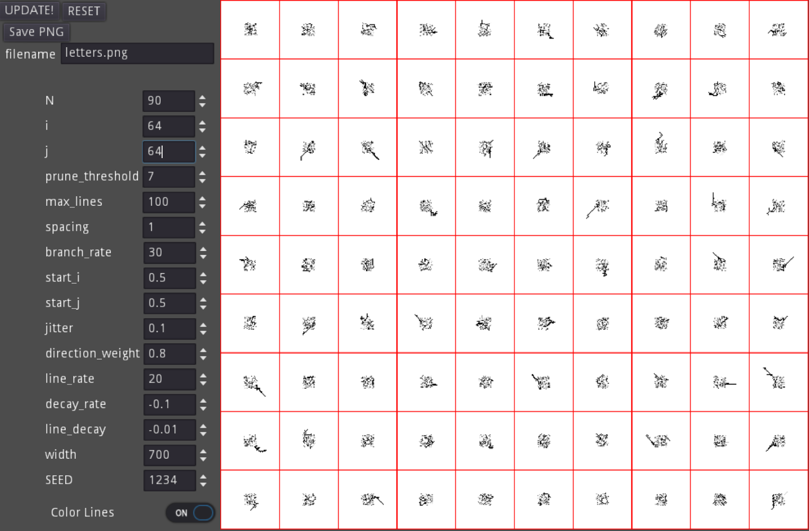

This is a very naive and simple implementation to make 'natural' looking random 'characters/letters'.

List of the User Controllable variables and current defaults:

The approach is roughly (from def generate_letters() docstring):
```python
'''
    For each character (N)
        - pick a pixel (based on i, j, start_i, start_j, jitter)
        - pick the next pixel or stop (based on direction_weight, branch_rate, and decay_rate)
        - start a new line (based on max_lines, line_rate, and line_decay)
        - prune pixels (based on prune_threshold)

    Returns a List of Letter objects which represent the on/off pixels for each letter (based on color_lines).

    :param N: int: How many character/letters to create
    :param i: int: Image height for each letter
    :param j: int: Image width for each letter
    :param branch_rate: float: rate to set how long of a 'stroke' for each line
    :param decay_rate: float: rate to slow down branch_rate. should be negative. low values decay slower
    :param start_i: float: percentage value on where to 'start' first line in height direction. 0 is top of letter image. 0.5 means start at height/2
    :param start_j: float: percentage value on where to 'start' first line in widtch direction. 0 is left side of letter image. 0.33 means to start 1/3 from the left.
    :param jitter: float: how much to randomize start_i, start_j. 0 means no randomness.
    :param prune_threshold: float: part of post-processing step to delete a pixel if it has "prune_threshold" number of neighbors, including diagonal. This tries to remove 'blockiness'
                            i.e. if prune_threshold = 5, then any pixels with 5 neighbors or more will be deleted.
                            this logic isn't complex and always starts at the top-left of each letter image.
    :param direction_weight: float: if 1.0, the next pixel selected will almost always be in the same direction. if 0.0, the next pixel is in a random direction. The algorithm tries to adjust the weights in the opposite direction in a gradient.
                             i.e. if direction_weight = 0.8 and the last pixel selected was to the right of the previous one, there's a very high chance the next pixel will also be to the right (to extend the line). There's an extremely low chance for the next pixel to be to the left.
                             For other directions, the chance is weighted towards the Right direction. so Up-Right and Down-Right have higher weights than directly Up and Down (which have higher weights than Up-Left and Down-Left)
                             This isn't perfect.
    :param line_rate: float: How much of a chance to create an additional line after the previous line is done.
    :param line_decay: float: How fast the line_rate decays. should be negative. low values decay slower.
    :param max_lines: float: The max number of lines to create
    :param color_lines: bool: if True, will save data in a 'grayscale' where each subsequent line is lighter than the previous.
    :param SEED: Optional[int]: random seed. If not passed, script will always generate random values. set this value if you want repeatable results.
    :return: List[Letter]: list of Letter objects that can be passed to make_letter_png()
    '''
```

See the code for details. 

There's a crude prototype to 'play' with the settings on [itch](https://jmbjr.itch.io/alien-alphabet)

